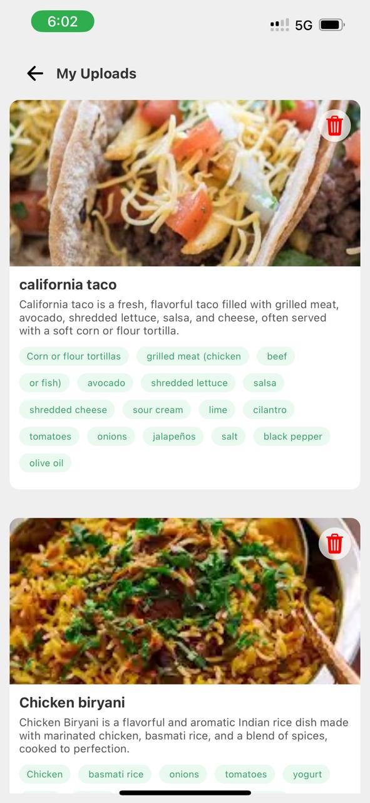

# Recipe Sharing App

## 📌 Overview
The **Recipe Sharing App** is a cross-platform mobile application built using **React Native**, allowing users to create, upload, and manage their recipes. The app supports user authentication with **Firebase Authentication & Clerk**, and image uploads via **Firebase Storage**. Users can categorize recipes, specify ingredients, and track their favorite recipes effortlessly.

## 🚀 Features
- 📸 **Upload Recipes**: Capture a photo or upload an image to create a recipe.
- 🔒 **User Authentication**: Secure login and signup using **Firebase Authentication & Clerk**.
- 📂 **Firebase Storage**: Store and retrieve images efficiently.
- 📑 **Recipe Management**: Add, view, and delete recipes with detailed descriptions and ingredients.
- ❤️ **Favorites**: Mark and manage favorite recipes.

## Screen Shots

<table>
  <tr>
    <td>
      <h3>Home Screen</h3>
      
    </td>
    <td>
      <h3>Create Recipe Screen</h3>
      
    </td>
  </tr>
  <tr>
    <td>
      <h3>My Recipes Screen</h3>
      
    </td>
    <td>
      <h3>Account Screen</h3>
      
    </td>
  </tr>
</table>


## 🛠️ Tech Stack
- **React Native** - For building the mobile application.
- **Firebase Authentication** - For user authentication.
- **Firebase Storage** - For storing recipe images.
- **Clerk** - For managing authentication seamlessly.

## 🔧 Installation & Setup
1. Clone the repository:
   ```sh
   git clone https://github.com/your-username/your-repo-name.git
   ```
2. Navigate to the project folder:
   ```sh
   cd your-repo-name
   ```
3. Install dependencies:
   ```sh
   npm install
   ```
4. Set up Firebase and Clerk in your `.env` file.
5. Run the app:
   ```sh
   npx react-native run-android  # For Android
   npx react-native run-ios      # For iOS
   ```


